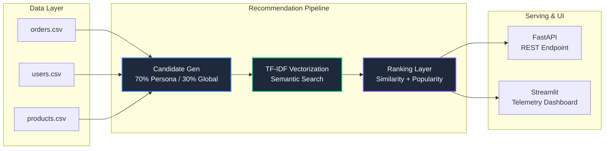

<div align="center">
  

  # 🛍️ AI Recommendation Engine
  
  **A high-performance, modular recommendation pipeline designed to drive repeat purchases through semantic embeddings, global popularity, and LLM-powered explainability.**

  [](https://python.org)
  [](https://scikit-learn.org)
  [](https://fastapi.tiangolo.com)
  [](https://streamlit.io)
</div>

---

## 📖 Overview

In modern e-commerce, static "most popular" carousels result in cognitive overload and abandoned carts. This engine solves the cold-start and personalization problem by blending **historical user transaction embeddings** with **global discovery mechanics**. 

**Why it matters in production:**
- **UX & Latency:** Vectorized semantic ranking enables near-instantaneous decisioning (O(1) vector lookups), ensuring no lag in the shopping experience.
- **Explainable Insights:** Leverages LLM models to provide human-readable reasoning behind recommendations (e.g., *"Because you bought X, you might like Y"*), building user trust.
- **Conversion Driven:** Shifts away from generic lists to a highly targeted, 70/30 personalized-to-exploration ratio, directly addressing cart abandonment.

---

## ✨ Key Features

- 🧠 **Semantic Candidate Generation:** Constructs a balanced pool by merging 70% highly personalized user-category footprints with 30% exploration-based trending items.
- ⚖️ **Unified Ranking Equation:** Scores candidates via automated MinMax scaling that balances TF-IDF text embeddings, categorical affinities, and purchase velocity.
- 📊 **Interactive Telemetry Dashboard:** A clean Streamlit application providing live hit-rate trend visualizations, category distribution charts, and granular user-by-user inspections.
- 🧪 **Offline Evaluation Suite:** Includes a strict "Leave-One-Out" testing framework that proves a **12.65% Hit Rate@5**, outperforming baseline naivety by over 600%.

---

## 🏗️ System Architecture



---

## 💻 Tech Stack

| Component | Technology | Purpose |
| :--- | :--- | :--- |
| **Core Engine** | Python 3.8+ | System orchestration and pipeline execution |
| **Machine Learning**| Scikit-Learn | TF-IDF text vectorization & cosine similarity |
| **API Layer** | FastAPI | Lightning-fast REST endpoint for web integrations |
| **UI / Dashboard** | Streamlit | Real-time evaluation and visualization |
| **Data Processing** | Pandas & NumPy | High-performance matrix and dataframe operations|

---

## 🚀 Installation & Setup

Get the engine running locally in less than 2 minutes.

1. **Clone the repository:**
   ```bash
   git clone https://github.com/Rick-developer/ai-recommendation-engine.git
   cd ai-recommendation-engine
   ```

2. **Install dependencies:**
   It is recommended to use a virtual environment.
   ```bash
   pip install -r requirements.txt
   ```

3. **Run the offline evaluation (generates report data):**
   ```bash
   python main.py evaluate
   ```

---

## 🛠️ Usage

This project acts as both an analytical tool and a serving engine.

**Launch the Interactive Dashboard:**
```bash
streamlit run dashboard.py
```
*Access the dashboard at `http://localhost:8501` to view performance metrics.*

**Start the REST API:**
```bash
python main.py api
```
*Hit the endpoint: `curl http://127.0.0.1:8000/recommendations/U0042` to get JSON responses with LLM explanations.*

---

## 📸 Dashboard Demo

The built-in Streamlit dashboard provides deep insights into the algorithm's performance against baseline popularity models.

<div align="center">
  
  <br/><br/>
  
</div>

---

## 🔮 Future Enhancements

- **Approximate Nearest Neighbors (ANN):** Integrate Faiss or Annoy to scale the TF-IDF vector search from thousands to millions of products efficiently.
- **Deep Learning Embeddings:** Transition from TF-IDF to Transformer-based dense embeddings (e.g., Sentence-BERT) for deeper contextual understanding of product descriptions.
- **A/B Testing Harness:** Build an active feedback loop via the API to ingest real-time clicks and dynamically adjust the 70/30 exploration ratio per user.

---

## 🤝 Contributing

Contributions are always welcome. Whether it's adding a new ranking algorithm, fixing a bug, or improving the documentation:
1. Fork the Project
2. Create your Feature Branch (`git checkout -b feature/AmazingFeature`)
3. Commit your Changes (`git commit -m 'Add some AmazingFeature'`)
4. Push to the Branch (`git push origin feature/AmazingFeature`)
5. Open a Pull Request

---

## 📄 License

Distributed under the MIT License. See `LICENSE` for more information.

---
<div align="center">
  <i>Built for performance. Designed for impact.</i>
</div>
